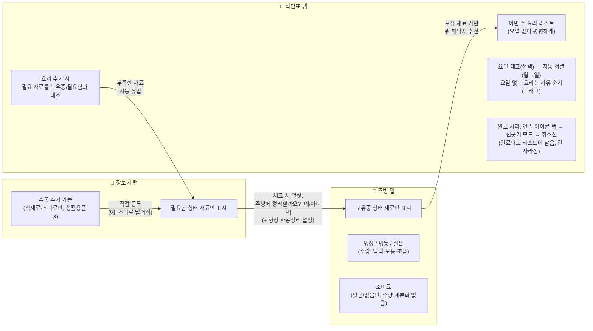

# 냉장고 프로젝트 — 플로우 문서

> 대화하면서 정해지는 것들을 여기에 계속 업데이트합니다.

## 1. 큰 그림 (1단계)

## 2. 데이터 모델 핵심 원칙

- 재료는 **하나의 데이터**이고, **상태값(보유중 / 필요함)** 만 다르게 가짐
  → 주방 탭과 장보기 탭은 같은 데이터를 다른 상태로 필터링해서 보여주는 것 (데이터 중복 없음)
- 조미료도 보유중/필요함 상태는 **다른 재료와 동일하게 존재**함. 다만 넉넉/보통/조금 같은 **세부 수량 단계만 없음**
- "뭐 해먹지" **추천** 단계에서는 조미료를 깐깐하게 따지지 않음 (있다고 가정하고 후보 제시)
- 요리를 **실제로 식단표에 추가(확정)** 하는 단계에서는 조미료 포함 전체 재료를 보유중/필요함과 정확히 대조함 → 없는 조미료는 이때 장보기로 유입

## 3. 재료 등록 방식 (주방 탭)

- 재료는 **미리 등록해둔 개인 사전에서 검색해서 선택** (매번 타이핑 X)
- 초기엔 자주 쓰는 재료 위주 100개 안팎만 준비, 실사용하며 개인 사전이 점점 자라남
- 검색해서 없으면 그 자리에서 새로 등록 (이름 + 카테고리 수동 지정) → 이후부터 검색에 포함됨
- 카테고리는 재료 데이터에 기본값이 딸려있어 자동 지정, 상태 기본값은 "넉넉"
  → 기본 경로는 **탭 한 번**으로 등록 완료

## 4. 확정된 것 / 아직 열려있는 것

**확정**
- 탭 구조: 주방 / 식단표 / 장보기 (3개 고정)
- 재료 카테고리: 냉장 / 냉동 / 실온 / 조미료 (뎁스 없이 flat)
- 재료 수량: 넉넉 / 보통 / 조금 (조미료 제외, 단 조미료도 보유중/필요함 상태 자체는 동일하게 가짐)
- 식단표: 요일 없이 평평한 리스트 + 요리별 선택적 요일 태그
- 정렬: 요일 있는 요리는 자동(월→일), 없는 요리는 자유 드래그
- 완료 처리: 연필 아이콘 → 선긋기 모드 → 취소선 (사라지지 않음)
- 장보기 수동 추가: 가능 (식재료·조미료 한정) — 자동으로는 절대 안 걸리는 조미료 소진 등을 보완하는 용도
- 장보기 탭의 정체성: "장 볼 것 전체를 관리하는 곳"이 아니라 **"주방 재고와 연결된 재고 연동 다리"** — 이름과 실제 역할 사이 오해가 있었음을 확인
- 인터랙션 구현: Rive 학습해서 적용 (드래그, 선긋기, 눌림 효과)
- UI 무드: 따뜻하고 아기자기한 손그림, 리스트/카드 UI 탈피 → "만질 수 있는 종이 메모판" 컨셉
- 설계 진행 방식: ① 큰 플로우 → ② 작은 플로우(탭별) → ③ 세부 UX 순으로, 폭을 좁혀가며 진행

**아직 미정 (2단계 잔여 + 3단계)**
- 밀프랩/밑반찬처럼 여러 끼 나눠먹는 요리를 리스트에서 어떻게 표현할지
- "뭐 해먹지" 추천 개수, 재추천 흐름
- 재료 등록용 초기 100개 리스트 구성 (3단계)
- 장보기 탭 이름 자체를 바꿀지 (정체성은 정리됐으나 명칭은 재검토 여지 있음)
- 세부 UX (아이콘, 색상, 정확한 애니메이션)

## 5. 협업 및 문서 관리 방식

**디자이너와 협업 시 도구 구성**

| | 용도 |
|---|---|
| FigJam | 플로우/기획 논의 (이 문서의 역할을 이어받음) |
| Figma | 실제 화면 디자인, Dev Mode로 개발 스펙 추출 |
| Notion / Google Docs | PRD — 댓글, 실시간 동시 편집 |
| Git | 결정 로그 최종 기록, 코드/에셋 버전 관리 |

- 결정권 기준으로 분리: 기능/데이터 로직은 구조대장 주도, 비주얼/인터랙션 디테일은 디자이너 주도
- 결정 로그는 영역별로 섹션 구분해서 관리 (기능/로직 vs 디자인/인터랙션)
- Figma/FigJam은 자체 버전 히스토리 보유 — 중요 시점마다 이름 붙여 스냅샷 저장 (예: "MVP 1차 확정")

**디자이너의 Git 학습 (이번 프로젝트를 계기로 진행)**

이 프로젝트를 통해 디자이너가 Git 사용과 코드에 익숙해지는 것도 목표로 삼기로 함. 단계별로 노출 강도를 높여가는 방식:

1. GitHub Desktop으로 커밋/푸시 개념 익히기 (PRD.md, flow.md 같은 마크다운 파일부터)
2. 브랜치 + PR 올리고 리뷰받는 흐름 연습 (충돌 위험 낮은 파일로)
3. 아이콘/에셋 파일, 디자인 토큰(색상·폰트 값) 파일을 직접 저장소에 커밋
4. 코드 한 줄을 같이 고쳐보며 "코드가 화면과 연결된다"는 감각 익히기

매주 한 단계씩 노출, 저장소에 `CONTRIBUTING.md`를 두어 지금 어느 단계인지 안내

---
*마지막 업데이트: 대화 진행에 따라 계속 갱신*
